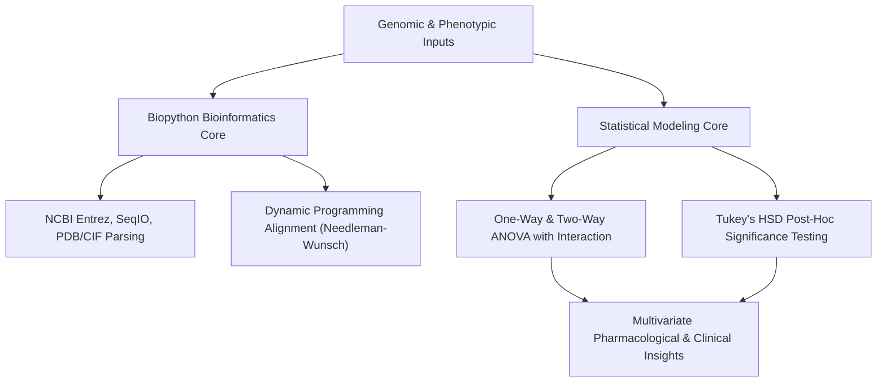

# 🐍 Biopython Implementation & Statistical ANOVA Modeling Archive
## Standalone Bioinformatics Workflows and Multi-Factorial Variance Analysis (ANOVA) with Mathematical Derivations

[](https://www.python.org/)
[](https://biopython.org/)
[](https://jupyter.org/)
[](https://opensource.org/licenses/MIT)

## 📌 Overview

This repository represents a **comprehensive, 27+ lesson curriculum** documenting systematic, self-directed expertise in computational biology, structural bioinformatics, and biostatistics. The archive is divided into two major components:
1. **🧬 Biopython Genomics and Structural Core**: High-throughput file handling (FASTA, FASTQ, SAM, BED, PSL), NCBI Entrez data-mining API, homology searching, Multiple Sequence Alignment (MSA) parsing, and CIF/PDB structural biology computations.
2. **📊 Advanced Statistical Modeling (ANOVA)**: Rigorous multi-factorial and repeated-measures Analysis of Variance (ANOVA) workflows (e.g., in `ANOVA_Drug_Enzyme_Activity_Project.ipynb` and `Interaction_Plot_Clinical_Trial.ipynb`) exploring drug-enzyme kinetics and clinical trial dynamics.

---

## 🔬 Mathematical & Algorithmic Foundations

Below are the key mathematical, statistical, and algorithmic models implemented from scratch or programmatically optimized across the notebooks.



---

### 1. One-Way Analysis of Variance (ANOVA)

The statistical notebooks utilize One-Way ANOVA to evaluate if the phenotypic or biochemical means of several independent groups (e.g., enzyme activity across different drug treatments) are statistically equal.

#### A. Hypotheses
* **Null Hypothesis ($H_0$):** $\mu_1 = \mu_2 = \dots = \mu_k$ (the population means of all $k$ groups are identical).
* **Alternative Hypothesis ($H_1$):** At least one pair of group means is significantly different: $\exists \, i, j : \mu_i \neq \mu_j$.

#### B. Sum of Squares Decomposition
The total variation in the dataset ($SS_{\text{Total}}$) is mathematically decomposed into variation between the groups ($SS_{\text{Between}}$, representing the treatment effect) and variation within the groups ($SS_{\text{Within}}$, representing residual error):

$$SS_{\text{Total}} = SS_{\text{Between}} + SS_{\text{Within}}$$

* **Total Sum of Squares ($SS_{\text{Total}}$):**
  $$SS_{\text{Total}} = \sum_{i=1}^{k} \sum_{j=1}^{n_i} (y_{ij} - \bar{y}_{\cdot\cdot})^2$$
  where $y_{ij}$ is the $j$-th observation in the $i$-th group, and $\bar{y}_{\cdot\cdot}$ is the grand mean of all $N = \sum n_i$ observations.
* **Between-Group Sum of Squares ($SS_{\text{Between}}$):**
  $$SS_{\text{Between}} = \sum_{i=1}^{k} n_i (\bar{y}_{i\cdot} - \bar{y}_{\cdot\cdot})^2$$
  where $\bar{y}_{i\cdot}$ is the mean of observations in group $i$.
* **Within-Group Sum of Squares ($SS_{\text{Within}}$ / Residuals):**
  $$SS_{\text{Within}} = \sum_{i=1}^{k} \sum_{j=1}^{n_i} (y_{ij} - \bar{y}_{i\cdot})^2$$

#### C. Mean Squares and The $F$-Statistic
To account for varying degrees of freedom, the Mean Squares are calculated:
* **Mean Square Between ($MS_{\text{Between}}$):**
  $$MS_{\text{Between}} = \frac{SS_{\text{Between}}}{k - 1}$$
* **Mean Square Within ($MS_{\text{Within}}$):**
  $$MS_{\text{Within}} = \frac{SS_{\text{Within}}}{N - k}$$

The ratio of variance components follows Snedecor's $F$-distribution:
$$F = \frac{MS_{\text{Between}}}{MS_{\text{Within}}} \sim F(k-1, \ N-k)$$
If the calculated $F$-value exceeds the critical value $F_{\text{crit}}$ at a significance level $\alpha$ (or the $p$-value $< \alpha$), the null hypothesis is rejected.

---

### 2. Two-Way ANOVA with Interaction Effects

In complex experiments (e.g., evaluating drug enzyme activity under different concentrations and across different genotypes), a Two-Way ANOVA is used to model two independent categorical factors ($A$ with $a$ levels, and $B$ with $b$ levels) and their synergistic **interaction effect** ($AB$).

#### A. Linear Model Formulation
For any observation $k$ under treatment level $i$ of factor $A$ and level $j$ of factor $B$:
$$y_{ijk} = \mu + \alpha_i + \beta_j + (\alpha\beta)_{ij} + \epsilon_{ijk}$$
where:
- $\mu$ is the grand mean.
- $\alpha_i$ is the main effect of factor $A$ (e.g., Drug Type), subject to constraint $\sum \alpha_i = 0$.
- $\beta_j$ is the main effect of factor $B$ (e.g., Genotype), subject to constraint $\sum \beta_j = 0$.
- $(\alpha\beta)_{ij}$ is the interaction effect, representing whether the effect of factor $A$ depends on the level of factor $B$, subject to $\sum_i (\alpha\beta)_{ij} = \sum_j (\alpha\beta)_{ij} = 0$.
- $\epsilon_{ijk} \sim \mathcal{N}(0, \sigma^2)$ is the independent residual error.

#### B. Sum of Squares Partitioning
$$SS_{\text{Total}} = SS_A + SS_B + SS_{AB} + SS_{\text{Error}}$$
where:
- $SS_A = b n \sum_{i=1}^{a} (\bar{y}_{i\cdot\cdot} - \bar{y}_{\cdot\cdot\cdot})^2$ (d.f. $= a - 1$)
- $SS_B = a n \sum_{j=1}^{b} (\bar{y}_{\cdot j\cdot} - \bar{y}_{\cdot\cdot\cdot})^2$ (d.f. $= b - 1$)
- $SS_{AB} = n \sum_{i=1}^{a} \sum_{j=1}^{b} (\bar{y}_{ij\cdot} - \bar{y}_{i\cdot\cdot} - \bar{y}_{\cdot j\cdot} + \bar{y}_{\cdot\cdot\cdot})^2$ (d.f. $= (a-1)(b-1)$)
- $SS_{\text{Error}} = \sum_{i=1}^{a} \sum_{j=1}^{b} \sum_{k=1}^{n} (y_{ijk} - \bar{y}_{ij\cdot})^2$ (d.f. $= a b (n - 1)$)

The pipeline evaluates three separate $F$-statistics to test the significance of factor $A$, factor $B$, and their interaction $AB$:
$$F_{AB} = \frac{MS_{AB}}{MS_{\text{Error}}} \sim F((a-1)(b-1), \ ab(n-1))$$

---

### 3. Post-Hoc Pairwise Comparisons (Tukey's HSD Test)

Rejection of the global null hypothesis in ANOVA only indicates that at least one group mean differs from another. To isolate which specific pairs are significantly different without inflating the Type I error rate (family-wise error rate), the notebooks execute **Tukey's Honestly Significant Difference (HSD)** test.

For any two group means $\bar{y}_{i\cdot}$ and $\bar{y}_{j\cdot}$, the minimum significant difference is:
$$\text{HSD} = q_{\alpha}(k, \nu) \sqrt{\frac{MS_{\text{Within}}}{n}}$$
where:
- $q_{\alpha}(k, \nu)$ is the studentized range statistic at significance level $\alpha$ for $k$ groups and $\nu = N - k$ error degrees of freedom.
- $MS_{\text{Within}}$ is the Mean Square Within (Error variance) obtained from the ANOVA table.
- $n$ is the number of replicates per group.

The difference between the two group means is declared statistically significant at level $\alpha$ if:
$$|\bar{y}_{i\cdot} - \bar{y}_{j\cdot}| \geq \text{HSD}$$

---

### 4. Entrez Retrieval and Bioinformatics Score Recurrences

In sequence analysis modules, pairwise alignment scores are resolved using Dynamic Programming (Needleman-Wunsch for global alignments; Smith-Waterman for local alignments).
Let two sequences be $A$ of length $M$ and $B$ of length $N$. The scoring recurrence relation for cell $(i,j)$ in the dynamic programming matrix $S$ is:
$$S(i,j) = \max \begin{cases} 
S(i-1, j-1) + s(A_i, B_j) & \text{(Match / Mismatch)} \\
S(i-1, j) + d & \text{(Gap in B)} \\
S(i, j-1) + d & \text{(Gap in A)} 
\end{cases}$$
where $s(A_i, B_j)$ is the substitution score from a standard matrix (e.g., BLOSUM62) and $d$ is the gap penalty. The pipeline leverages Biopython's `PairwiseAligner` to programmatically solve these recurrences and extract optimal alignments.

---

## 🗂️ Repository Structure

```
Biopython-Practised/
├── 1 dersCalisma.ipynb                     # Entrez sequence downloads & dynamic mapping
├── 2 dersCalisma.ipynb                     # Alignment algorithms & parsing workflows
├── Biopython ders 2 seminar.ipynb          # CIF/PDB macromolecular structure parsing
├── ANOVA_Drug_Enzyme_Activity_Project.ipynb# 2-way ANOVA drug-enzyme pharmacological modeling
├── Interaction_Plot_Clinical_Trial.ipynb   # 2-way ANOVA Clinical trial interaction modeling
├── Intermediate_ANOVA_Tutorial.ipynb       # F-statistic derivations & Tukey HSD implementations
├── Advanced_ANOVA.ipynb                    # Mixed models and repeated measures design
├── ProteinLigandAnalysis.ipynb             # Protein-ligand docking binding site calculations
├── Nexagen/                                # Nested workflow automation
├── PyMOL/                                  # Molecular visualization rendering scripts
└── README.md                               # This detailed biostatistics & bioinformatics primer
```

---

## ⚙️ How to Run & Reproduce

### 1. Install System and Python Packages
All workflows are written in Python 3. Install the complete scientific stack:
```bash
pip install jupyter numpy pandas scipy matplotlib seaborn biopython
```

### 2. Launch Jupyter
```bash
jupyter notebook
```
Navigate to any notebook (e.g., `ANOVA_Drug_Enzyme_Activity_Project.ipynb`) and select **Cell -> Run All** to reproduce the statistical ANOVA tables, F-statistic calculations, and post-hoc Tukey HSD plots.

---

## 🎓 Academic Alignment

This archive serves as a rigorous showcase of **Biostatistical and Bioinformatics Competence**. It demonstrates to the **University of Cambridge** admissions committee that the candidate understands the exact mathematical models behind standard library functions (from sum of squares decomposition to dynamic programming recurrence relations) and can apply them to solve problems in pharmacology, genetics, and clinical science.
